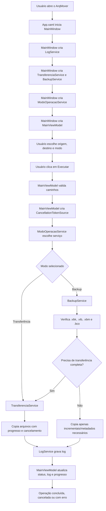
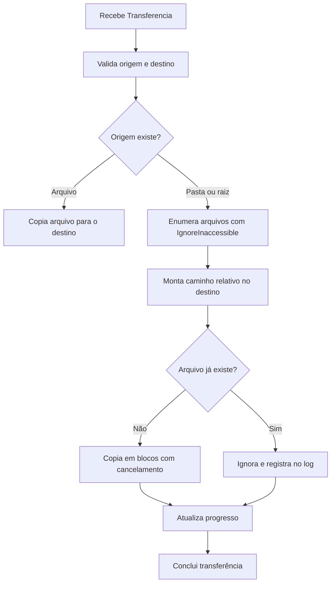
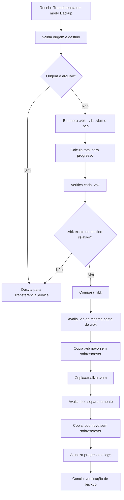

# ArqMover

ArqMover é uma aplicação desktop Windows para transferência de arquivos, pastas e rotinas de backup. O projeto foi desenvolvido em C# com WPF e tem foco em copiar conteúdos entre uma origem e um destino, exibindo progresso, status, logs e permitindo cancelamento da operação em andamento.

## Para Que Serve

O aplicativo atende dois cenários principais:

- **Transferência normal**: copia um arquivo único, uma pasta ou o conteúdo de uma raiz de disco para um destino informado.
- **Gestão de backups**: trata backups, verificando arquivos base e incrementais antes de copiar novos itens.

No modo backup, o app trabalha com:

- `.vbk`: arquivo completo/base do backup.
- `.vib`: arquivos incrementais ligados ao `.vbk`.
- `.vbm`: metadados da cadeia, podendo ser atualizado no destino.
- `.bco`: arquivos de configuração, tratados separadamente da cadeia `.vbk`.

## Tecnologias

- C#
- .NET 9 Windows
- WPF
- Janelas de diálogo do Windows Forms para seleção de arquivos e pastas
- Arquivos de log em disco

## Estrutura do Projeto

```text
ArqMover
|-- ArqMover.sln
|-- ArqMover.Desktop
|   |-- App.xaml
|   |-- App.xaml.cs
|   |-- Core
|   |   |-- Enums
|   |   |   `-- ModoOperacao.cs
|   |   |-- Models
|   |   |   `-- Transferencia.cs
|   |   `-- Services
|   |       |-- BackupService.cs
|   |       |-- ModoOperacaoService.cs
|   |       |-- TransferenciaService.cs
|   |       |-- Dialogs
|   |       |   `-- FolderDialogService.cs
|   |       `-- Interfaces
|   |           `-- IOperacaoService.cs
|   |-- Infrastructure
|   |   `-- Logs
|   |       `-- LogService.cs
|   |-- Interface
|   |   `-- Controllers
|   |       |-- MainWindow.xaml
|   |       |-- MainWindow.xaml.cs
|   |       `-- ViewController
|   |           `-- MainViewModel.cs
|   `-- Resources
|       `-- Styles
|           `-- MainStyles.xaml
`-- LICENSE
```

## Onde a Aplicação Começa

A aplicação inicia em `App.xaml`, que define a janela inicial:

```xml
StartupUri="Interface/Controllers/MainWindow.xaml"
```

O fluxo inicial é:

1. `App.xaml` abre `MainWindow.xaml`.
2. `MainWindow.xaml.cs` cria os serviços principais.
3. `MainWindow.xaml.cs` cria a `MainViewModel`.
4. A `MainViewModel` vira o contexto de dados (`DataContext`) da tela.
5. O usuário seleciona origem, destino e modo de operação.
6. Ao clicar em `Executar`, a tela chama `MainViewModel.ExecutarAsync()`.

## Relação Entre Camadas

### Interface

Responsável pela tela, eventos de clique e vinculação de dados.

Arquivos principais:

- `MainWindow.xaml`: layout da aplicação.
- `MainWindow.xaml.cs`: eventos de interface e criação dos serviços.
- `MainViewModel.cs`: estado da tela, validação básica, progresso, cancelamento e chamada dos serviços.

### Core

Responsável pelas regras principais da aplicação.

Arquivos principais:

- `Transferencia.cs`: modelo com origem, destino, modo e data de criação.
- `ModoOperacao.cs`: enum com `Transferencia` e `Backup`.
- `IOperacaoService.cs`: contrato comum para serviços executáveis.
- `ModoOperacaoService.cs`: escolhe qual serviço executar.
- `TransferenciaService.cs`: copia arquivos, pastas e raízes.
- `BackupService.cs`: aplica regras específicas de backup.

### Infrastructure

Camada de infraestrutura, responsável por serviços de apoio.

- `LogService.cs`: cria a pasta `Logs`, grava arquivos `.log` e notifica a tela sobre novas mensagens.

### Resources

Pasta de recursos, responsável por estilos visuais.

- `MainStyles.xaml`: brushes, botões, campos, textos, barra de progresso e demais estilos WPF.

## Fluxo Geral da Aplicação



## Fluxo de Transferência Normal



## Fluxo de Backup



## Cancelamento

O cancelamento é controlado pela `MainViewModel` com `CancellationTokenSource`.

Quando o usuário clica em `Cancelar`:

1. A tela chama `CancelarOperacao_Click`.
2. O evento chama `MainViewModel.CancelarOperacao()`.
3. A ViewModel registra `Cancelamento solicitado pelo usuario`.
4. O token é cancelado.
5. Os serviços interrompem a operação ao encontrar `ThrowIfCancellationRequested()`.
6. Cópias grandes param durante a cópia porque os arquivos são copiados em blocos.
7. A ViewModel registra `Operacao cancelada pelo usuario`.

## Logs

Os logs são gravados em:

```text
bin/Debug/net9.0-windows/Logs
```

Cada execução cria um arquivo com timestamp:

```text
yyyy-MM-dd_HH-mm-ss.log
```

As mensagens também aparecem na área de log da tela.

## Regras Importantes

- Pastas protegidas, como `System Volume Information`, são ignoradas durante enumeração.
- Arquivos existentes na transferência normal não são sobrescritos.
- `.vib` nunca sobrescreve arquivo existente.
- `.bco` nunca sobrescreve arquivo existente.
- `.vbm` pode sobrescrever para manter metadados atualizados.
- Se a origem for raiz de disco, o destino base é o próprio destino escolhido.
- Se a origem for pasta, o destino base recebe uma subpasta com o nome da origem.
- Se a origem for arquivo em modo backup, o fluxo desvia para transferência normal.

## Como Compilar

```powershell
dotnet build ArqMover.sln
```

Se o aplicativo estiver aberto e bloqueando o `.exe`, use:

```powershell
dotnet build ArqMover.sln /p:UseAppHost=false
```

## Como Gerar o Executável

Para gerar o executável em modo de publicação (`Release`):

```powershell
dotnet build ArqMover.sln -c Release
```

O executável será gerado em:

```text
ArqMover.Desktop/bin/Release/net9.0-windows/ArqMover.Desktop.exe
```

Para gerar uma pasta de publicação pronta para distribuição:

```powershell
dotnet publish ArqMover.Desktop/ArqMover.Desktop.csproj -c Release -r win-x64 --self-contained false
```

Saída esperada:

```text
ArqMover.Desktop/bin/Release/net9.0-windows/win-x64/publish/
```

Se quiser gerar uma versão independente, incluindo o ambiente de execução do .NET:

```powershell
dotnet publish ArqMover.Desktop/ArqMover.Desktop.csproj -c Release -r win-x64 --self-contained true
```

Nesse caso, a pasta `publish` fica maior, mas a máquina de destino não precisa ter o ambiente de execução do .NET instalado.

## Licença

Este projeto é distribuído sob a licença MIT. Veja o arquivo `LICENSE`.
